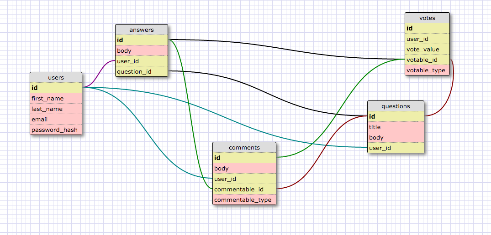

# Overflow

###Team Recursive

###Team Members
* Kevin Huang - Merge Master
* David Rothschild
* Gary Wong
* Timur Catakli

###Project Expectations

###MVP
* As a logged in user I should be able to post questions
* As a non-logged in user I cannot add a question, answer, or vote unless I am logged in, but I can view all of the above when logged out. (2-3 hours)
* As a logged in user I should be able to answer questions
* As a logged in user I should be able to reply to answers (2-3 hours)
* As a logged in person who posted a question can declare one of the user-submitted answers "the best."
* As a logged in user, I  should be able to vote on questions, answers, and responses (both upvotes and downvotes) - only once. (2-3 hours)

###Deliverable Features
